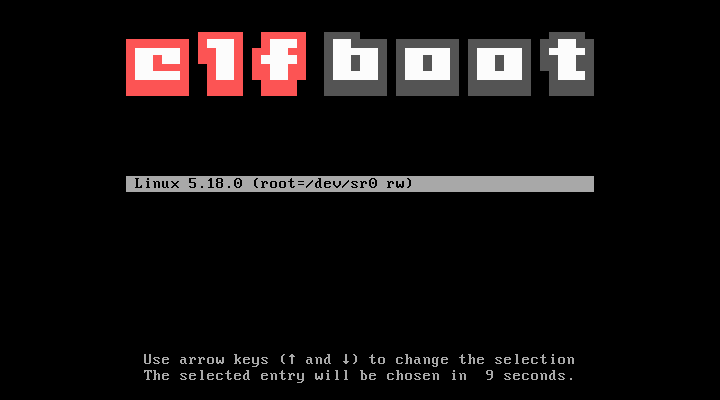

A multiboot-compliant *Executable and Linking Format* (ELF) bootloader for the x86 architecture.

### Features ###

 is a highly modular BIOS bootloader for the x86 architecture . It supports drivers for both IDE and AHCI/RAID controllers. Further modules include file system drivers like *ISO 9660*. For the graphical boot menu, a simple PS/2 keyboard module is available, too.

Currently, we support the following modules:

 - Programmable Interval Timer (PIT)
 - PS/2 Keyboard module

For PCI devices, we also provide modules for:

 - IDE controller
 - AHCI/RAID controller

As for file systems, we currently support:

 - ISO 9660
 - ext2

Even the screen is managed by a module, which depends on the screen resolution used:

 - TTY driver <sub>(currently VGA only)</sub>

### Building elfboot-toolchain ###

 can be built with both a custom GCC toolchain as well as [clang](https://github.com/llvm/llvm-project). The steps to prepare each toolchain is described below.

#### clang ####

To use clang as the compiler to build this project, make sure that it supports the `x86` target. If you haven't built the LLVM project yet, you can use this script and place it in the root directory of the LLVM repository:

```
#!/bin/sh

mkdir build
cd build

# We set the following options:
#
# CMAKE_BUILD_TYPE=Release
# 	Build the Release version for a faster compiler
#
# LLVM_ENABLE_PROJECTS=clang\;lld
# 	We want to build both LLVM and clang, the latter
# 	has to be named explicitely. Same for lld.
#
# LLVM_STATIC_LINK_CXX_STDLIB=ON
#	Increase performance by statically linking libstdc++
#
# LLVM_TARGETS_TO_BUILD=X86
# 	For now, we only support x86/x86-64

cmake 	-DCMAKE_BUILD_TYPE=Release		\
	-DLLVM_ENABLE_PROJECTS=clang\;lld\;	\
	-DLLVM_STATIC_LINK_CXX_STDLIB=ON	\
	-DLLVM_TARGETS_TO_BUILD=X86			\
	../llvm
```
After `cmake` finishes, you can `cd` into the `build` directory created by this script and build the LLVM binaries via `make`.

#### GCC toolchain ####

For building the project via GCC, we recommend using [crosstool-ng](https://crosstool-ng.github.io/) to build a compatible cross-compiler for the i686 architecture. Please refer to the official documentation on the crosstool-ng website for further information.

### Configuring and building elfboot ###

 is highly customizable. You can see a few sample configurations in the `configs` folder. For a more detailed description of how the different configurations affect the build of the bootloader, see [configs/README.md](configs/README.md).

All that's left is to create a configuration file `elfboot.config` in the root folder of this project and adjust the settings accordingly. If you are happy with the configured options, build the bootloader by typing

```
make iso
```

> **Note**: For now, we only support the generation of *ISO 9660* formatted disks. In the near future, we also want to support other file systems.

### Booting kernels ###

Each boot entry is defined in the `elfboot.cfg` boot file, which contains information about each kernel found. If only one entry is available, you can configure elfboot to directly boot the kernel without any graphical boot menu. An example for a valid boot entry for a Linux boot would look as follows:

```
bootentry "Linux 5.18.0" {
	kernel linux /root/boot/bzImage
	initrd /root/boot/rootfs.cpio.gz
	cmdline root=/dev/sr0 rw
}
```

> **Note**: Currently, we only support booting Linux. Further boot protocols are going to be introduced in the near future.

 currently supports the following boot protocols:

 - Linux (module **lxboot**)

In the near future, we want to at least implement two more protocols:

 - Multiboot (1, 2)
 - Stivale

### Screenshot ###

